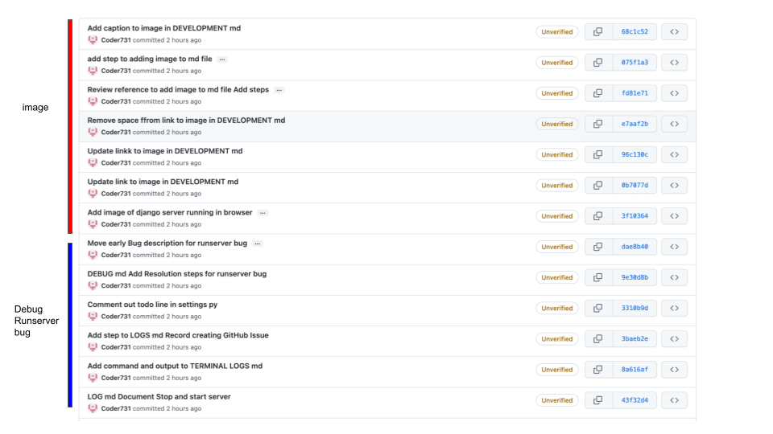
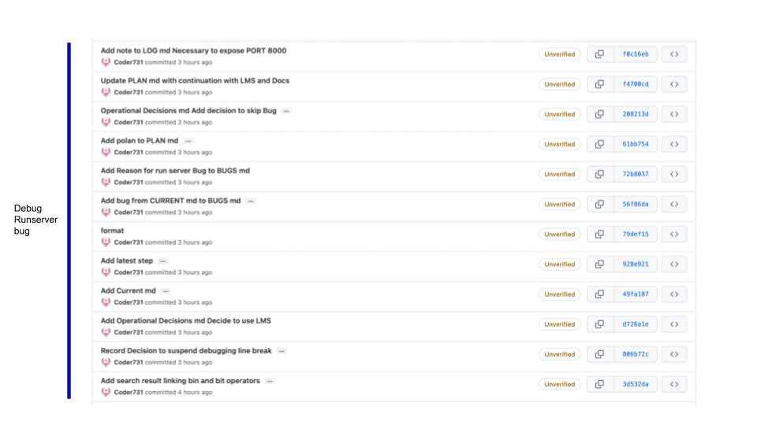
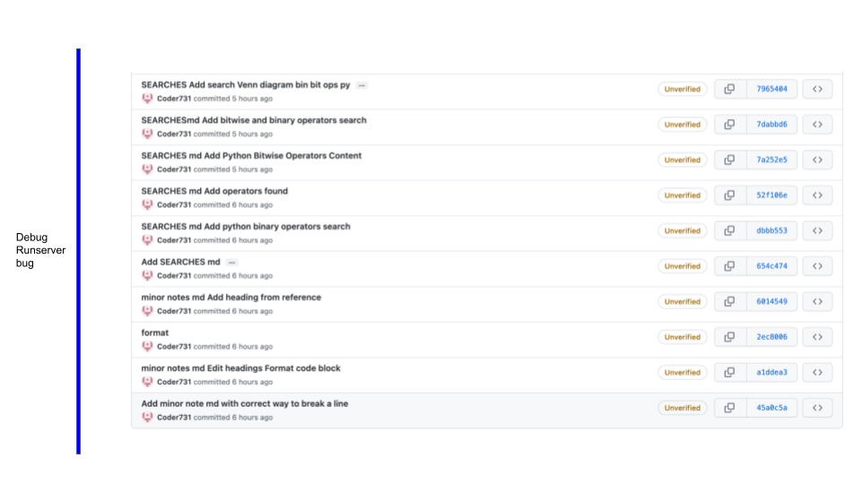
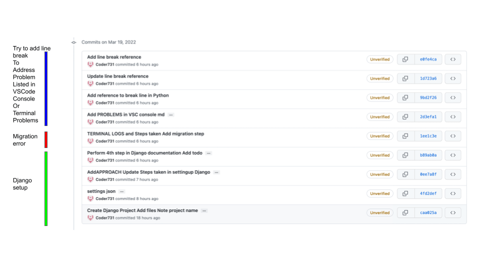
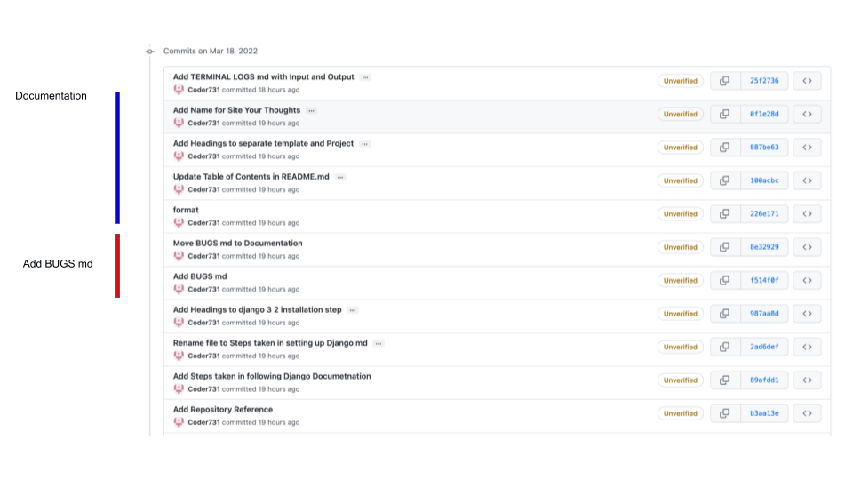
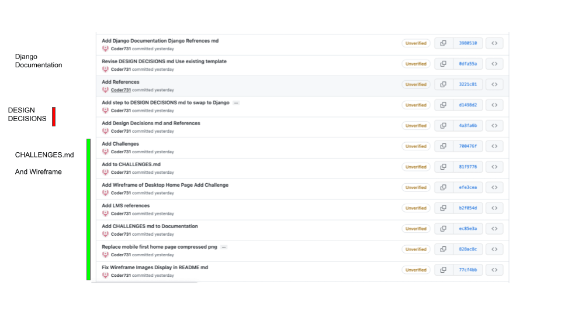

## Topics of commits in this document:
- image
- Debug Runserver bug
- Try to add line break to addressproblem listed in Visual Studio Code Console or Terminal Problems
- Migration Error
- Django setup
- Documentation
- Add BUGS.md
- Django Documentation
- DESIGN DECISIONS
- CHALLENGES.md And Wireframe

commits-summary-1 
commits-summary-2 
commits-summary-3 
commits-summary-4 
commits-summary-5 
commits-summary-6 

