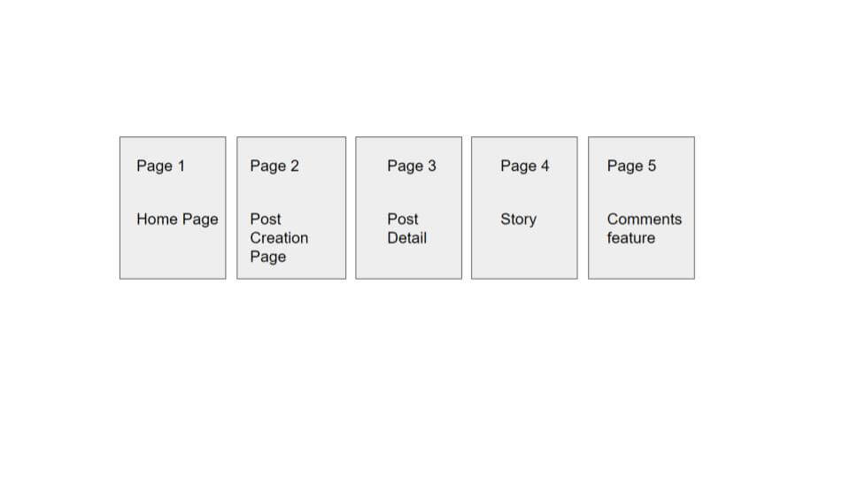
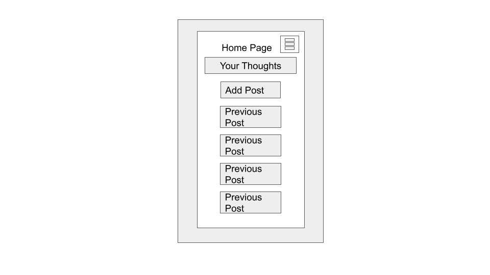
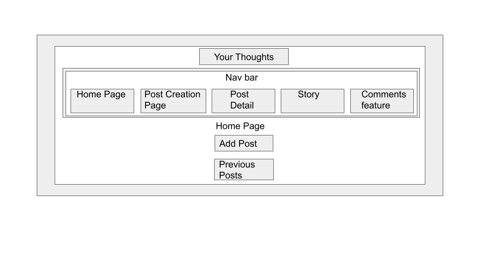
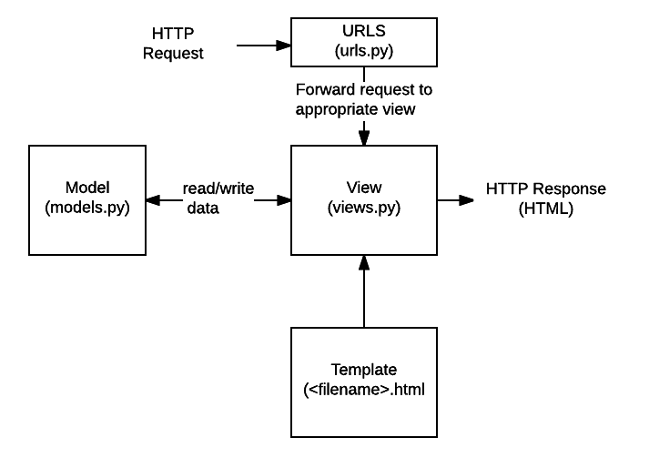
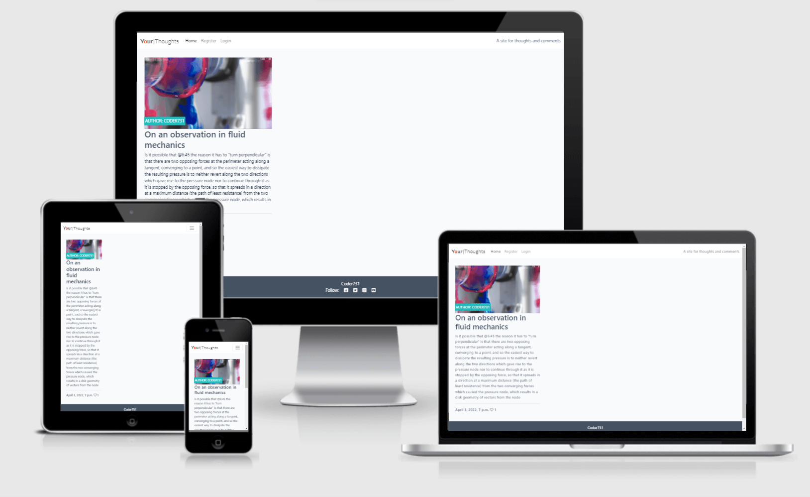

# Part 1 of 2: Non-stock README.md contents for Portfolio-Project-4

## Design Approach
Mobile first

## Documentation (Table of Contents)
In repository:
Navigate to Documentation folder.

**Main Documentation Files present:**
- BUGS.md
- CHALLENGES.md
- DEBUG.md
- DESIGN-DECISIONS.md
- LOG.md
- PLAN.md
- REFERENCES.md

### Django-Documentation (Subfolder)
- Django-References.md
- Steps-taken-in-setting-up-Django.md


## Wireframe
Overview 

Mobile First Home Page 

Desktop Home Page 

## Elements of Website
- Django
- login


## Design Thinking and Agile Approach
(LMS Reference: Django Blog 002: Project Prerequisites)

- Content important
- Easy signup
- Easy to engage

- Problem statement:
How to develop a blog application that provides this functionality to the user?

## Technologies used:
- [Python](https://www.python.org/)
- [Django](https://docs.djangoproject.com/en/4.0/topics/i18n/)
- [HTML5](https://en.wikipedia.org/wiki/HTML5)
- [CSS](https://en.wikipedia.org/wiki/CSS)
- [JavaScript](https://en.wikipedia.org/wiki/JavaScript)
- [GitHub](https://github.com/)
- [Gitpod](https://www.gitpod.io/)
- [Visual Studio Code](https://code.visualstudio.com/)
- [Cloudinary](https://cloudinary.com/)
- [Bootstrap](https://getbootstrap.com/docs/5.1/getting-started/contents/)
- [heroku](https://en.wikipedia.org/wiki/Heroku)
- [tiny png](https://tinypng.com/)
- [diffchecker](https://www.diffchecker.com/)
- [YouTrack JetBrains](https://www.jetbrains.com/youtrack/)

## Theory
### Django
django schematic 
[Django introduction](https://developer.mozilla.org/en-US/docs/Learn/Server-side/Django/Introduction/basic-django.png)

## Validation
- [CSS Validation](https://beautifytools.com/javascript-validator.php)
- [JS Validation](https://jigsaw.w3.org/css-validator/validator)

## Deployed site:


## Main References:
## Template
- [Template](https://github.com/Code-Institute-Org/gitpod-full-template)
### LMS Tutorials:
- Hello Django
- I think therefore I blog
- Building an eCommerce platform
### Corresponding repositories:
- [Hello Django](https://github.com/Code-Institute-Solutions/Hello-Django-Django3/tree/master/08-Testing)
- [Django3blog](https://github.com/Code-Institute-Solutions/Django3blog/blob/master/12_final_deployment/)
- [eCommerce platform](https://github.com/Code-Institute-Solutions/Boutique-Ado/tree/master/05-The-Home-Page)
## Video on which post observation was made
- [Two Vortex Rings Colliding in SLOW MOTION - Smarter Every Day 195](https://youtu.be/EVbdbVhzcM4?t=381)
## Other references
- Stackoverflow

For further references, see REFERENCES.md in Documentation folder.

## Notes on deployment
For errors in the database and migrations, as a last resort:
### Completely remove Django migrations and reset database

1. Remove the all migrations files in project. Go through each of project apps' migration folders and remove everything inside, except the __init__.py file.

2. Drop the database. If using Heroku Postgres, the command for this is: 
- `heroku login -i`

- `heroku pg:reset DATABASE_URL`.

    - Locally, delete the db.sqlite3 file.
Note: only use if no other option.
3.  Run the commands python3 manage.py makemigrations and python3 manage.py migrate to remake migrations and setup the new database.

### Standard Deployment
1. Once `python3 manage.py makemigrations` and `python3 manage.py migrate` are run
`python3 manage.py createsuperuser`
2. Push to GitHub and heroku
Note: Must authorise GitHub to connect to heroku
3. Either use Automatic deployment or manual deployment
4. Click Open App

Note:
DEBUG = False

From Django Documentation(https://docs.djangoproject.com/en/4.0/howto/deployment/checklist/):
`When DEBUG = False, Django doesn’t work at all without a suitable value for ALLOWED_HOSTS.`


## Agile Methodology:


### Sprint n-1: 
#### Add CRUD Functionality

###### Analyze

###### Plan
Review tutorials for 'I think therefore I blog'
###### Design
Rewatch videos
###### Build
Edit CRUD functionality
###### Test
Test CRUD functionality
- Can user add post?
- Can user delete post?
- Can user update post?
- Can user Read post?
###### Review
TBC
###### Launch
TBC
### Sprint n:
#### Steps: 
##### Analyze:
###### Bug found while working on adding CRUD functionality
```need to provide CLOUDINARY_STORAGE dictionary with CLOUD_NAME, API_SECRET and API_KEY in the settings or set CLOUDINARY_URL variable```
### Iteration 2 of Sprint:
##### Plan:
Defer until revising deployment section of project
##### Design:
TBC
##### Build:
TBC
##### Test:
change DEBUG to:
```DEBUG = 'DEVELOPMENT' in os.environ```
However, this does not resolve the issue.

Added CLOUDINARY_URL to Gitpod environment variables on Gitpod dashboard.

Restarted Gitpod Workspace

```python3 manage.py runserver```

Runs server.
##### Review:
The 3 steps were:
1. change DEBUG in settings.py
2. add CLOUDINARY_URL to Gitpod environment variables on Gitpod dashboard
3. restart Gitpod workspace
##### Launch:
###### To run server locally run:
```python3 manage.py runserver```


###### To run server on heroku:
Go to Heroku 
### Iteration 2:

#### Second bug after getting local server working
##### Analyze
Get results of first iteration:
```
OperationalError at /
no such table: Your_Thoughts_post
Request Method:	GET
Request URL:	http://localhost:8000/
Django Version:	3.2
Exception Type:	OperationalError
Exception Value:	
no such table: Your_Thoughts_post
Exception Location:	/workspace/.pip-modules/lib/python3.8/site-packages/django/db/backends/sqlite3/base.py, line 423, in execute
Python Executable:	/home/gitpod/.pyenv/versions/3.8.11/bin/python3
Python Version:	3.8.11
Python Path:	
['/workspace/Portfolio-Project-4',
 '/home/gitpod/.pyenv/versions/3.8.11/lib/python38.zip',
 '/home/gitpod/.pyenv/versions/3.8.11/lib/python3.8',
 '/home/gitpod/.pyenv/versions/3.8.11/lib/python3.8/lib-dynload',
 '/workspace/.pip-modules/lib/python3.8/site-packages',
 '/home/gitpod/.pyenv/versions/3.8.11/lib/python3.8/site-packages']
Server time:	Tue, 09 Aug 2022 21:28:07 +0000
```
##### Plan
Test if it deploys on heroku

##### Design
TBC
##### Build
TBC
##### Test
Test if it deploys on heroku
##### Review
TBC
##### Launch
TBC

#### 3rd iteration:
Go to heroku to check app is working
##### Analyze
TBC
##### Plan
Go to heroku to check app is working
##### Design
TBC
##### Build
TBC
##### Test
Go to heroku to check app is working
##### Review
TBC
##### Launch
TBC
#### Reference:
- [Iteration vs Sprint vs cadence in Agile [Meaning and difference]](https://bigpicture.one/sprint-cadence-iteration/)


#### More Agile Theory

```
What Is the Agile Sprint Cycle?
The Agile sprint cycle, or workflow, is the repetitive process that developers use to tackle a development project. A software project can take as many as ten sprint cycles.

Although there is room for variation, most sprint cycles break down like this:

Planning

Backlog

The Sprint

Daily Scrum

Outcome

Sprint End

Sprint review.

Sprint retrospective.
```
#### Reference for the above quoted paragraphs
- [Agile Sprint in Software Development: Definition, Process, and Roles Involved: What Is the Agile Sprint Cycle?](https://www.simplilearn.com/agile-sprint-article#:~:text=The%20Agile%20sprint%20cycle%2C%20or,many%20as%20ten%20sprint%20cycles.)

# Log of work
## Bug continued

```
OperationalError at /
no such table: Your_Thoughts_post
Request Method:	GET
Request URL:	http://localhost:8000/
Django Version:	3.2
Exception Type:	OperationalError
Exception Value:	
no such table: Your_Thoughts_post
```

### Potential fix:
Run migrations

### Continuous log of Terminal

```
  File "/workspace/.pip-modules/lib/python3.8/site-packages/django/db/backends/utils.py", line 84, in _execute
    return self.cursor.execute(sql, params)
  File "/workspace/.pip-modules/lib/python3.8/site-packages/django/db/backends/sqlite3/base.py", line 423, in execute
    return Database.Cursor.execute(self, query, params)
django.db.utils.OperationalError: no such table: Your_Thoughts_post
[10/Aug/2022 09:50:49] "GET / HTTP/1.1" 500 175476
Not Found: /favicon.ico
[10/Aug/2022 09:50:50] "GET /favicon.ico HTTP/1.1" 404 3280
^Cgitpod /workspace/Portfolio-Project-4 (main) $ python3 manage.py makemigrations --dry-run
Migrations for 'django_summernote':
  /workspace/.pip-modules/lib/python3.8/site-packages/django_summernote/migrations/0003_alter_attachment_id.py
    - Alter field id on attachment
gitpod /workspace/Portfolio-Project-4 (main) $ python3 manage.py makemigrations
Migrations for 'django_summernote':
  /workspace/.pip-modules/lib/python3.8/site-packages/django_summernote/migrations/0003_alter_attachment_id.py
    - Alter field id on attachment
gitpod /workspace/Portfolio-Project-4 (main) $ python3 manage.py migrate --plan
Planned operations:
contenttypes.0001_initial
    Create model ContentType
    Alter unique_together for contenttype (1 constraint(s))
auth.0001_initial
    Create model Permission
    Create model Group
    Create model User
Your_Thoughts.0001_initial
    Create model Post
    Create model Comment
account.0001_initial
    Create model EmailAddress
    Create model EmailConfirmation
account.0002_email_max_length
    Alter field email on emailaddress
admin.0001_initial
    Create model LogEntry
admin.0002_logentry_remove_auto_add
    Alter field action_time on logentry
admin.0003_logentry_add_action_flag_choices
    Alter field action_flag on logentry
contenttypes.0002_remove_content_type_name
    Change Meta options on contenttype
    Alter field name on contenttype
    Raw Python operation
    Remove field name from contenttype
auth.0002_alter_permission_name_max_length
    Alter field name on permission
auth.0003_alter_user_email_max_length
    Alter field email on user
auth.0004_alter_user_username_opts
    Alter field username on user
auth.0005_alter_user_last_login_null
    Alter field last_login on user
auth.0006_require_contenttypes_0002
auth.0007_alter_validators_add_error_messages
    Alter field username on user
auth.0008_alter_user_username_max_length
    Alter field username on user
auth.0009_alter_user_last_name_max_length
    Alter field last_name on user
auth.0010_alter_group_name_max_length
    Alter field name on group
auth.0011_update_proxy_permissions
    Raw Python operation ->     Update the content_type of prox…
auth.0012_alter_user_first_name_max_length
    Alter field first_name on user
django_summernote.0001_initial
    Create model Attachment
django_summernote.0002_update-help_text
    Alter field name on attachment
django_summernote.0003_alter_attachment_id
    Alter field id on attachment
sessions.0001_initial
    Create model Session
sites.0001_initial
    Create model Site
sites.0002_alter_domain_unique
    Alter field domain on site
socialaccount.0001_initial
    Create model SocialAccount
    Create model SocialApp
    Create model SocialToken
    Alter unique_together for socialtoken (1 constraint(s))
    Alter unique_together for socialaccount (1 constraint(s))
socialaccount.0002_token_max_lengths
    Alter field uid on socialaccount
    Alter field client_id on socialapp
    Alter field key on socialapp
    Alter field secret on socialapp
socialaccount.0003_extra_data_default_dict
    Alter field extra_data on socialaccount
gitpod /workspace/Portfolio-Project-4 (main) $ python3 manage.py migrate
Operations to perform:
  Apply all migrations: Your_Thoughts, account, admin, auth, contenttypes, django_summernote, sessions, sites, socialaccount
Running migrations:
  Applying contenttypes.0001_initial... OK
  Applying auth.0001_initial... OK
  Applying Your_Thoughts.0001_initial... OK
  Applying account.0001_initial... OK
  Applying account.0002_email_max_length... OK
  Applying admin.0001_initial... OK
  Applying admin.0002_logentry_remove_auto_add... OK
  Applying admin.0003_logentry_add_action_flag_choices... OK
  Applying contenttypes.0002_remove_content_type_name... OK
  Applying auth.0002_alter_permission_name_max_length... OK
  Applying auth.0003_alter_user_email_max_length... OK
  Applying auth.0004_alter_user_username_opts... OK
  Applying auth.0005_alter_user_last_login_null... OK
  Applying auth.0006_require_contenttypes_0002... OK
  Applying auth.0007_alter_validators_add_error_messages... OK
  Applying auth.0008_alter_user_username_max_length... OK
  Applying auth.0009_alter_user_last_name_max_length... OK
  Applying auth.0010_alter_group_name_max_length... OK
  Applying auth.0011_update_proxy_permissions... OK
  Applying auth.0012_alter_user_first_name_max_length... OK
  Applying django_summernote.0001_initial... OK
  Applying django_summernote.0002_update-help_text... OK
  Applying django_summernote.0003_alter_attachment_id... OK
  Applying sessions.0001_initial... OK
  Applying sites.0001_initial... OK
  Applying sites.0002_alter_domain_unique... OK
  Applying socialaccount.0001_initial... OK
  Applying socialaccount.0002_token_max_lengths... OK
  Applying socialaccount.0003_extra_data_default_dict... OK
```

# Sprint Iteration 1: Fix local website
## PROBLEM STATEMENT:
    - At this point the remote website was working, but the local version was not.  The remote deployment was a few commits behind.
## Part 1 of fix: Identify cause of problem:    
    - So, the first part of the fix was to identify that the DATABASE_URL variable in this if statement:
    
    ```
    if 'DATABASE_URL' in os.environ:
        DATABASES = {
            'default': dj_database_url.parse(os.environ.get('DATABASE_URL'))
        }
    ```
    
    meant that the settings.py file was looking for DATABASE_URL in whatever environment the site was deployed in.
    - Therefore, when the site was deployed in the heroku environment, because the DATABASE_URL was present as an environment variable,
      the site content was able to be displayed on the version of the site deployed and running on heroku.
    - However, when the site was deployed in the GitPod environment, since the DATABASE_URL was not present as an environment variable,
      the site content was not able to be displayed on the version of the site being run from the local GitPod server.
## Part 2 of the fix: Add variable to environment
    - The second part of the fix was to add the DATABASE_URL variable present in the heroku workspace environment variables to the GitPod workspace environment variables.
    - However, the local site still did not display content.  Therefore, the GitPod workspace was stopped and restarted from the [GitPod Dashboard](https://gitpod.io/dashboard).
    - This restart fixed the issue aand the content now displayed on local as well.


# Sprint Iteration 2: Testing and Fix Content
## Testing
### To Check "Like" functionality
#### Test "Like" functionality.
Try to like post
-  Not possible as not logged in
#### First, login.
As local environment was stopped in the previous iteration of this sprint, during this iteration, 
- Then logged in.
#### Test Like functionality.
Try to like post.
Success.

#### Test Add Comment Functionality (Create in CRUD)
Added comment.
Clicked Submit Button.
##### Bug [Resolved]
Comment did not display on website.
##### Debug [Resolved]
Logged in as admin, clicked on Comments.
Comment present.
Clicked on Users.
User not verified.
Ticked verified box.
Now comment displays for user.
[Resolved]
Detail on fix necessary in code below for comment not displaying:
# Fix post functionality
## In the Your_Thoughts App folder:
### In the views.py post function
Move the first return statement to after the "if else block" and comment everything in the function that comes afterwards.

### In the urls.py
#### In urlpatterns
add post/ to the start of the paths for:
- slug
    - render views.PostDetail as view
- like/slug
    - render views.PostDetail as view


## Documenting lines of code
### Overview (of views in Your_Thoughts App)
There are two main folders in this project.  
One is called Profile_Project_4 (PP4 Proj).  This is the project folder.
The other is the Your_Thoughts App (YT App).
The YT App has admin.py, apps.py forms.py models.py urls.py and view.py
- The views file has
    - class PostList(generic.ListView):
    - class PostDetail(View):
        - def get(self, request, slug, *args, **kwargs):
            - return render(request,"post_detail.html",{post, comments, commented, liked, comment_form})
        - def post(self, request, slug, *args, **kwargs):
            -         if post.likes.filter(id=self.request.user.id).exists():
                        liked = True
    -                 else:
                        post.likes.add(request.user)
    -         comment_form = CommentForm(data=request.POST)
        if comment_form.is_valid():
        else:
            comment_form = CommentForm()
        return HttpResponseRedirect(reverse('post_detail', args=[slug]))
class PostLike(View):
    def post(self, request, slug, *args, **kwargs):
        if post.likes.filter(id=request.user.id).exists():
        else:
            post.likes.add(request.user)
        return HttpResponseRedirect(reverse('post_detail', args=[slug]))
def get_comment(user_request):
    return render(user_request, 'Your_Thoughts/comment-page.html', context)
def add_post(user_request):
    return render(user_request, 'Your_Thoughts/add_post.html', context)
def edit_post(user_request, post_id):
    return render(user_request, 'Your_Thoughts/edit_post.html', context)
def toggle_post(user_request, post_id):
    return redirect('get_comment')
def delete_post(user_request, post_id):
    return redirect('get_comment')

## Issue found with website
### Individual Comment approval
Currently the site allows a user who is logged to post a comment.
However, in order for this comment to be displayed, currently an admin user must access the admin page, go to the User/Comment and approve the comment.  Currently this must be done for each individual comment.

# Testing
## Run test 
Check to see if changing from approved=True to approved=False
allows a user to post an unapproved comment.
Test failed, so this change was not pushed to version control.
# Error testing django debug toolbar
Expected: Local server to load site
Actual: Site not loading received error.
Traceback from error:
```
Traceback (most recent call last):
  File "/home/gitpod/.pyenv/versions/3.8.11/lib/python3.8/threading.py", line 932, in _bootstrap_inner
    self.run()
  File "/home/gitpod/.pyenv/versions/3.8.11/lib/python3.8/threading.py", line 870, in run
    self._target(*self._args, **self._kwargs)
  File "/workspace/.pip-modules/lib/python3.8/site-packages/django/utils/autoreload.py", line 64, in wrapper
    fn(*args, **kwargs)
  File "/workspace/.pip-modules/lib/python3.8/site-packages/django/core/management/commands/runserver.py", line 157, in inner_run
    handler = self.get_handler(*args, **options)
  File "/workspace/.pip-modules/lib/python3.8/site-packages/django/contrib/staticfiles/management/commands/runserver.py", line 31, in get_handler
    handler = super().get_handler(*args, **options)
  File "/workspace/.pip-modules/lib/python3.8/site-packages/django/core/management/commands/runserver.py", line 78, in get_handler
    return get_internal_wsgi_application()
  File "/workspace/.pip-modules/lib/python3.8/site-packages/django/core/servers/basehttp.py", line 49, in get_internal_wsgi_application
    raise ImproperlyConfigured(
django.core.exceptions.ImproperlyConfigured: WSGI application 'Profile_Project_4.wsgi.application' could not be loaded; Error importing module.
``` 
Actions:
Removed recently added code for django debug toolbar. (from INSTALLED_APPS and MIDDLEWARE)

# Debugging
## 1
Unable to login as admin on local
### Working towards solution
Check django-admin version
returned 4.1
which was unexpected as 3.2 is in requirements.txt

#### Aside
For Django 4.1 need to add another csrf variable (CSRF_TRUSTED_ORIGINS) to settings.py
with both the local app url (without trailing forwardslash) and heroku deployed app url (added with and without trailing forwardslash)
### Fix
pip install -r requirements.txt
this reverted to django 3.2
### Update 
Check re dependabot security update
Enable dependabot updates in GitHub settings for repository.
Check dependabot security update recommendations
#### Fix 
Change django version from 3.2 to 3.2.14 in requirements.txt
to patch critical vulnerability to sql injection.
### Update
Per dependabot:
Django 3.2 before 3.2.15 and 4.0 before 4.0.7 vulnerable to Reflected File Download attack #16
#### Fix
Change requirements.txt
from 3.2.14 to 3.2.15
### Update and fix
Per dependabot:
Key confusion through non-blocklisted public key formats #14
Action taken:
Update requirements.txt from pyjwt 2.3.0 to 2.4.0
### Update
run
```pip install  -r requirements.txt```
## 2
Internal server error on heroku
ran ```heroku logs --app your-thoughts-app```
ModuleNotFoundError: debug toolbar
### Fix:
Remove debug_toolbar from urls.py

# End of Sprint
## Finished sprint to address issue with comment approval
### Successful Google search string:
```why do i need to approve every single comment django project```
### Result: 
- [automatically accept comments](https://stackoverflow.com/questions/2553330/how-to-automatically-accept-comments-from-authenticated-users-in-django-contrib)

### Fix:
Changed False to True in models.py Comments model
approved field, so that comments are 
automatically approved, and so appear 
when added by user.

# Debug
When testing the deployed heroku app,
received an internal server error.
This was resolved by doing a ```pip install -r requirements.txt```,
which changed django version from 
4.1 (which had been displaying when ```django-admin version```
was run) to 3.2, which was then subsequently updated to
3.2.15 to address dependabot flagged security vulnerabilities.

# Next sprint
## Testing of CRUD functionality / Planning post testing
- With regard to Comments
    1. Should allow user to create, read, update and delete comments.
        - There should be an edit functionality in the comment. 
    2. Should display toasts for crud operations.


# Further work
## The following sprints
- map django schema
- try installing test package(s)

# Next sprint
- Rolled back migrations
- Got an error
- Uninstalled allauth
- Rolled forward migrations
- Reinstalled allauth

# Notes on Django theory
Django uses a specific case of MVC called MVT, Model View Template.
To write them so that the roles line up vertically would be as follows:
MVC
MTV
In Django the MVC Model is the model
The MVC "View" (not to be confused with Django's Views) is the html template. (The template is the user interface.)
The MVC Controller is the View. The views are where the logic lives.

- [ServerSide Web Frameworks Django Structure]

# References
- [django debug panel](https://github.com/recamshak/django-debug-panel)
- [CSRF_TRUSTED_ORIGINS required in settings.py](https://github.com/catmaid/CATMAID/issues/1781)
- [How to automatically accept comments from authenticated users in django.contrib.comments](https://stackoverflow.com/questions/2553330/how-to-automatically-accept-comments-from-authenticated-users-in-django-contrib)
- [Heroku giving 500 error with little information + Internal Server Error](https://stackoverflow.com/questions/46021463/heroku-giving-500-error-with-little-information-internal-server-error)
- [Forbidden (403) CSRF verification failed. Request aborted. Reason given for failure: Origin checking failed does not match any trusted origins](https://stackoverflow.com/questions/70285834/forbidden-403-csrf-verification-failed-request-aborted-reason-given-for-fail)
## CRUD References
- [PP4_masterclass](https://github.com/lechien73/PP4_masterclass/commits/main)

# Part 2 of 2: Stock Template for README.md


Welcome Coder731,

This is the Code Institute student template for Gitpod. We have preinstalled all of the tools you need to get started. It's perfectly ok to use this template as the basis for your project submissions.

You can safely delete this README.md file, or change it for your own project. Please do read it at least once, though! It contains some important information about Gitpod and the extensions we use. Some of this information has been updated since the video content was created. The last update to this file was: **September 1, 2021**

## Gitpod Reminders

To run a frontend (HTML, CSS, Javascript only) application in Gitpod, in the terminal, type:

`python3 -m http.server`

A blue button should appear to click: _Make Public_,

Another blue button should appear to click: _Open Browser_.

To run a backend Python file, type `python3 app.py`, if your Python file is named `app.py` of course.

A blue button should appear to click: _Make Public_,

Another blue button should appear to click: _Open Browser_.

In Gitpod you have superuser security privileges by default. Therefore you do not need to use the `sudo` (superuser do) command in the bash terminal in any of the lessons.

To log into the Heroku toolbelt CLI:

1. Log in to your Heroku account and go to *Account Settings* in the menu under your avatar.
2. Scroll down to the *API Key* and click *Reveal*
3. Copy the key
4. In Gitpod, from the terminal, run `heroku_config`
5. Paste in your API key when asked

You can now use the `heroku` CLI program - try running `heroku apps` to confirm it works. This API key is unique and private to you so do not share it. If you accidentally make it public then you can create a new one with _Regenerate API Key_.

------

## Release History

We continually tweak and adjust this template to help give you the best experience. Here is the version history:

**September 1 2021:** Remove `PGHOSTADDR` environment variable.

**July 19 2021:** Remove `font_fix` script now that the terminal font issue is fixed.

**July 2 2021:** Remove extensions that are not available in Open VSX.

**June 30 2021:** Combined the P4 and P5 templates into one file, added the uptime script. See the FAQ at the end of this file.

**June 10 2021:** Added: `font_fix` script and alias to fix the Terminal font issue

**May 10 2021:** Added `heroku_config` script to allow Heroku API key to be stored as an environment variable.

**April 7 2021:** Upgraded the template for VS Code instead of Theia.

**October 21 2020:** Versions of the HTMLHint, Prettier, Bootstrap4 CDN and Auto Close extensions updated. The Python extension needs to stay the same version for now.

**October 08 2020:** Additional large Gitpod files (`core.mongo*` and `core.python*`) are now hidden in the Explorer, and have been added to the `.gitignore` by default.

**September 22 2020:** Gitpod occasionally creates large `core.Microsoft` files. These are now hidden in the Explorer. A `.gitignore` file has been created to make sure these files will not be committed, along with other common files.

**April 16 2020:** The template now automatically installs MySQL instead of relying on the Gitpod MySQL image. The message about a Python linter not being installed has been dealt with, and the set-up files are now hidden in the Gitpod file explorer.

**April 13 2020:** Added the _Prettier_ code beautifier extension instead of the code formatter built-in to Gitpod.

**February 2020:** The initialisation files now _do not_ auto-delete. They will remain in your project. You can safely ignore them. They just make sure that your workspace is configured correctly each time you open it. It will also prevent the Gitpod configuration popup from appearing.

**December 2019:** Added Eventyret's Bootstrap 4 extension. Type `!bscdn` in a HTML file to add the Bootstrap boilerplate. Check out the <a href="https://github.com/Eventyret/vscode-bcdn" target="_blank">README.md file at the official repo</a> for more options.

------

## FAQ about the uptime script

**Why have you added this script?**

It will help us to calculate how many running workspaces there are at any one time, which greatly helps us with cost and capacity planning. It will help us decide on the future direction of our cloud-based IDE strategy.

**How will this affect me?**

For everyday usage of Gitpod, it doesn’t have any effect at all. The script only captures the following data:

- An ID that is randomly generated each time the workspace is started.
- The current date and time
- The workspace status of “started” or “running”, which is sent every 5 minutes.

It is not possible for us or anyone else to trace the random ID back to an individual, and no personal data is being captured. It will not slow down the workspace or affect your work.

**So….?**

We want to tell you this so that we are being completely transparent about the data we collect and what we do with it.

**Can I opt out?**

Yes, you can. Since no personally identifiable information is being captured, we'd appreciate it if you let the script run; however if you are unhappy with the idea, simply run the following commands from the terminal window after creating the workspace, and this will remove the uptime script:

```
pkill uptime.sh
rm .vscode/uptime.sh
```

**Anything more?**

Yes! We'd strongly encourage you to look at the source code of the `uptime.sh` file so that you know what it's doing. As future software developers, it will be great practice to see how these shell scripts work.

---

Happy coding!
